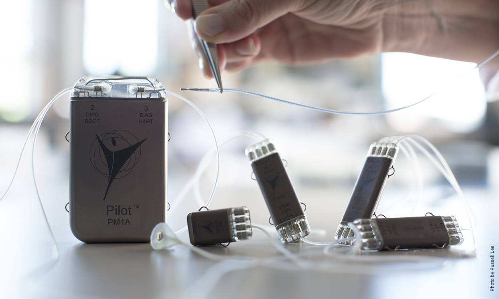

# Power Module

The power and communications hub of the COSMIIC System

---

## Product Description

The Power Module is an implanted module that has two key functions. First, it houses the rechargeable Li-ion batteries that supply power to the entire NNP implanted system, along with the required recharging link and circuitry. Second, it contains the wireless MedRadio link for transcutaneous communication and system programming. The power moduleconnects to the network through the network cable, placing power onto it for distribution to all remote modules.

The power module is designed for easy surgical replacement, and replacement is an anticipated and expected event based on the eventual depletion of the Li-ion batteries. Power module replacement is accomplished through a single small incision, disconnection of the network segment connection, and replacement with a new power module. This procedure is expected to be an outpatient procedure requiring less than 30 minutes.The power module is designed to be implanted in the torso, typically either chest or abdomen, because these portions of the body can accommodate the power module package size. This location also allows convenient access for recharging through an inductive link, and easy surgical exposure for replacement.

The power module contains a magnetically activated switch for emergency shut-down of the entire NNP system. This switch implements a failsafe shutdown function that will deenergize all of the power module circuitry in the presence of a strong, static magnetic field. The power module utilizes a 32 bit ARM-7 microprocessor, the NXP Semiconductor LPC2129 processor. The processor runs a real time operating system (RTOS). During functional operation, the power module primarily functions as the power source for the entire implanted NNP system. However, due to its significant processing power, it is capable of performing signal processing and data storage in support of the remote module functions when required. The power module is always active (except under the emergency shut-down condition), but can be placed into and taken out of a low-power ‘sleep’ mode by the user. 

The power module has a titanium case with feedthroughs for the network connections and antenna wire. An epoxy header holds the connections and antenna. A polymer nest inside the case holds the batteries and circuitry in place. The coil for inductive battery recharging surrounds the circuitry inside the case. Three identical Li-ion rechargeable cells are connected in parallel to provide the NNP system power.

## Coming soon...

Specifications, drawings, and test data are on their way
